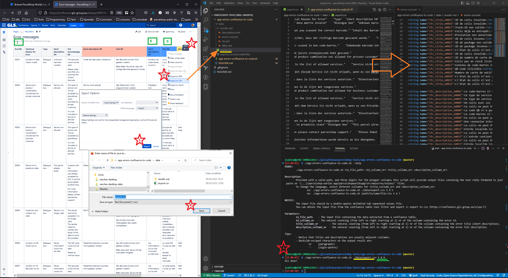

# APP Errors (Confluence >> Code)

This script is meant to halve the pain of copying+pasting when updating our app error messages.

To get the full description on how to use it, run the script with the *--help* flag.

A visual description follows:
